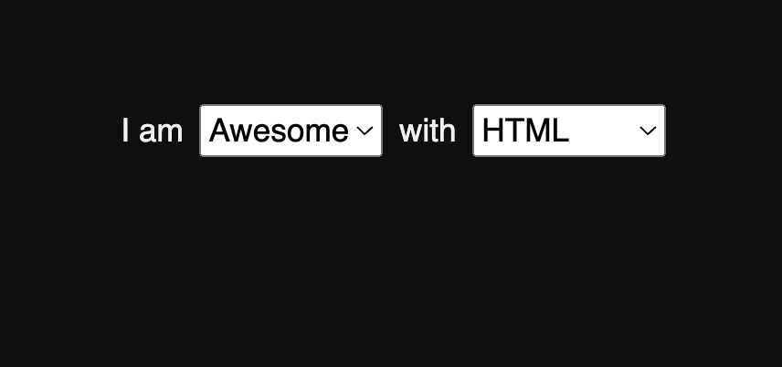
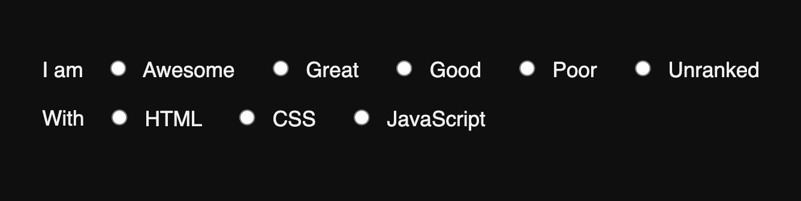
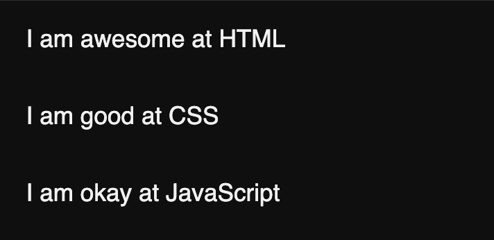

# Class Survey

## Part 1

The goal is to create an app to rank a student's understanding of the following topics (more will be added later!)

| Topic      |
| ---------- |
| HTML       |
| CSS        |
| JavaScript |

A student can rank their skill level using following scale:

| Ranking  | Value |
| -------- | ----- |
| Awesome  | 5     |
| Great    | 4     |
| Good     | 3     |
| Okay     | 2     |
| Poor     | 1     |
| Unranked | 0     |

The "Ranking" will be the value the user sees, the "Value" will be the value that is stored somewhere.
i.e. `<option value=5>Awesome</option>`

### Getting Started

- Create a new folder, initialize a git repository
- Create an index.html file (remember the shortcut to generate the boilerplate)
- Create a `scripts` or `js` folder and add your JavaScript file (i.e. a file named `scripts.js`, `main.js`, or `index.js`)
- Create a `styles` or `css` folder and add your Stylesheet (i.e. a file named `styles.css`, or `index.css`)
- [OPTIONAL] Use a CSS framework for added styling (i.e. Bulma or Tailwind)

### Setup the basics

- Make an array called `topics`, and fill it with the topics from above.
- Make another array called `rankings` and fill it with the rankings from above.

### The UI

- You're going to create a form that can be filled out to assign a ranking value for all the topics.
- Use the `topics` and `rankings` arrays ([see above](#setup-the-basics)) in JavaScript to build out the form contents.
- Think of some options for the HTML form elements to choose the ranking (see below)

Maybe `select` elements to create dropdowns?

Or maybe `radio` buttons?

Remember the `<fieldset>` and `<legend>` elements make using `<radio>` buttons easier/more semantic.

Or, show the topics as text and only have `select` or `radio` inputs for the rankings, or vice versa? :thinking:

### The Action

- Add an event handler to the form to display the results
- You decide if you want to build the results in JavaScript and append to the DOM, _or_ just append the results to predefined elements.

The output should look something like the following

